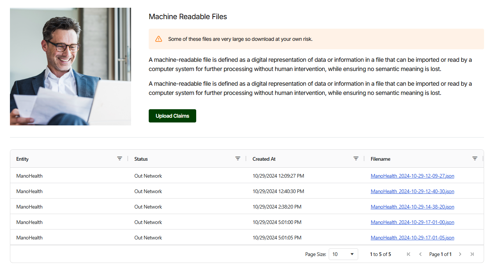

# ✅ ManoHealth Take-Home Assignment Submission

Thank you for the opportunity to work on this take-home assignment. I've attached a brief instruction for setting up and testing my technical solution by uploading, validating, and approving claims data in CSV format.

## 📸 Screenshot



## 🚀 Getting Started

### Prerequisites

To run the project, please make sure you have:

- **Node.js** (v20 or higher)
- **NPM** (Node Package Manager)
- **Git** (v2.48 or higher)

### Installation

1. **Clone the Repository**

   ```bash
   git clone https://github.com/blitzsprinter/mano-health-frontend-challenge.git
   cd mano-health-frontend-challenge
   ```

2. **Install Dependencies**

   Execute the following command to install all necessary dependencies:

   ```bash
   npm run postinstall
   ```

3. **Start the Backend Server**

   Run the backend server in development mode by running:

   ```bash
   npm run backend:dev
   ```

4. **Launch the Frontend Application**

   Start the React frontend application in development mode:

   ```bash
   npm run frontend:dev
   ```

5. **Build the React Application for Production**

   To build an optimized production version of the React app, use:

   ```bash
   npm run frontend:build
   ```

## 🧪 Testing & Code Quality

1. **Run Linter**
   Analyze the codebase for potential issues:

   ```bash
   npm run lint
   ```

2. **Format Codebase with Prettier**
   Format the codebase according to Prettier style guidelines:
   ```bash
   npm run format
   ```
